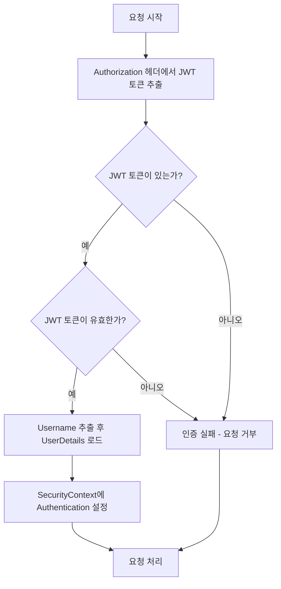

현대오토에버 모빌리티 스쿨 [영화리뷰 플랫폼]
===

# 💻 프로젝트 정보

## 팀원 소개
<table>
<thead>
<tr>
<th align="center"><strong>박준민</strong></th>
<th align="center"><strong>오정환</strong></th>
<th align="center"><strong>임동연</strong></th>
<th align="center"><strong>고채린</strong></th>
<th align="center"><strong>이유정</strong></th>
</tr>
</thead>
<tbody>
<tr>
<td align="center"><a href="https://github.com/pjm2571">   @pjm2571</a></td>
<td align="center"><a href="https://github.com/OhJeongHwan1">   @OhJeongHwan1</a></td>
<td align="center"><a href="https://github.com/yeon-dong">   @yeon-dong</a></td>
<td align="center"><a href="https://github.com/chaelin2">   @chaelin2</a></td>
<td align="center"><a href="https://github.com/LYJ22">   @LYJ22</a></td>
</tr>
</tbody>
</table>

## 사용자 인증/인가 flow

